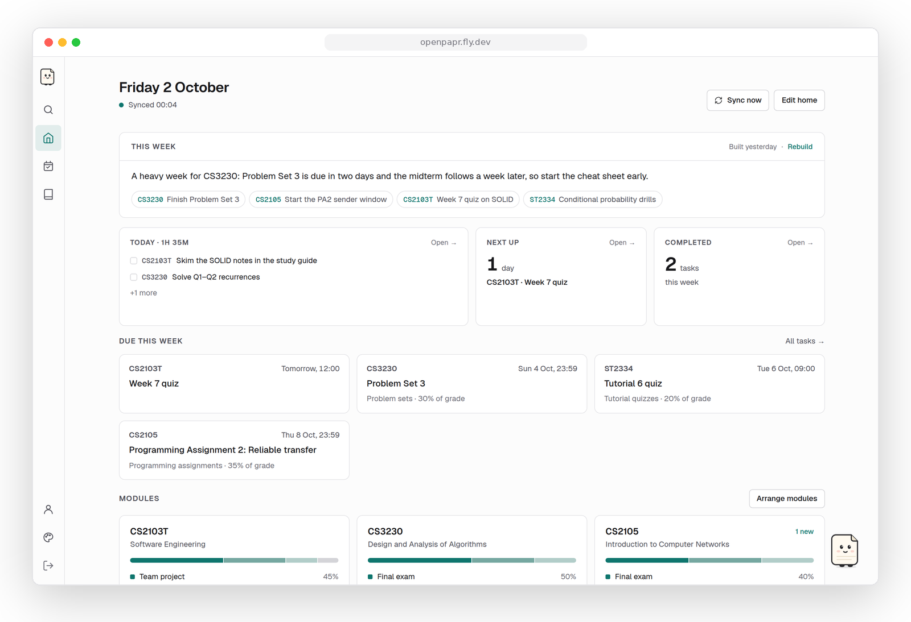
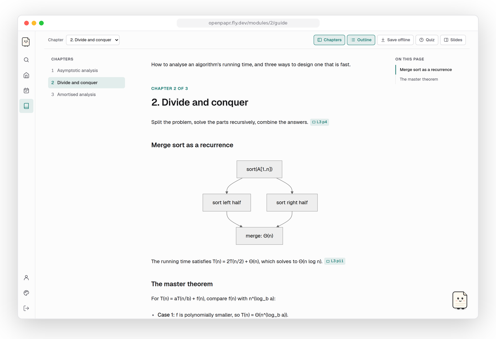
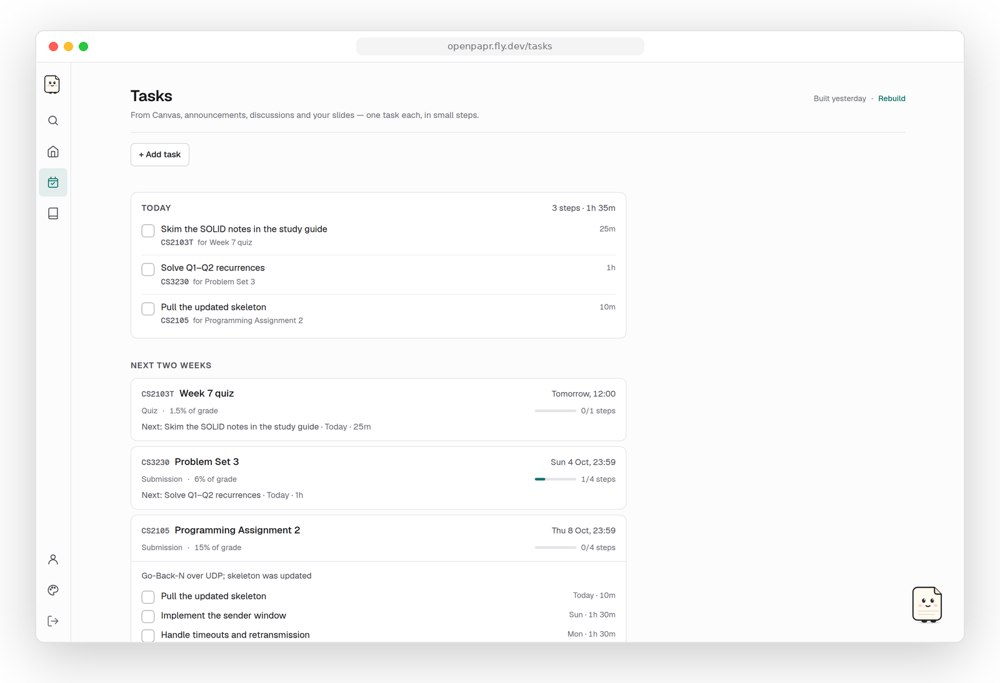
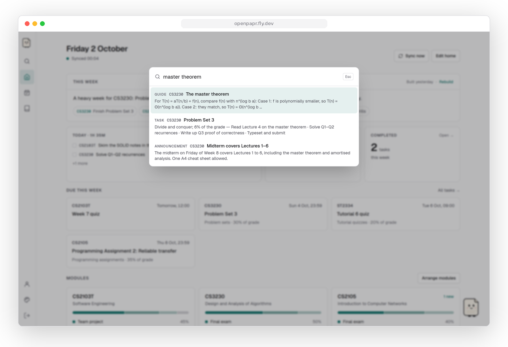
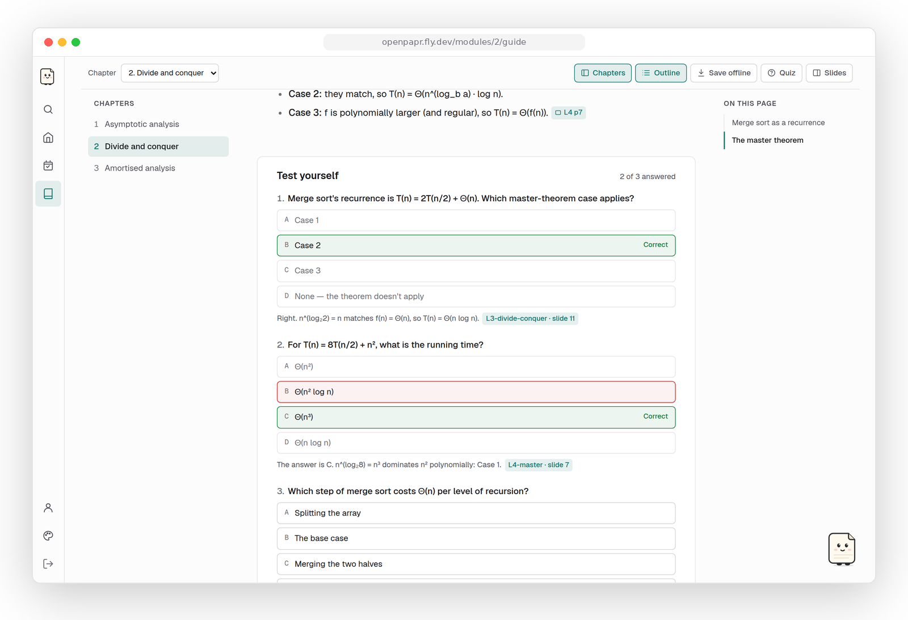
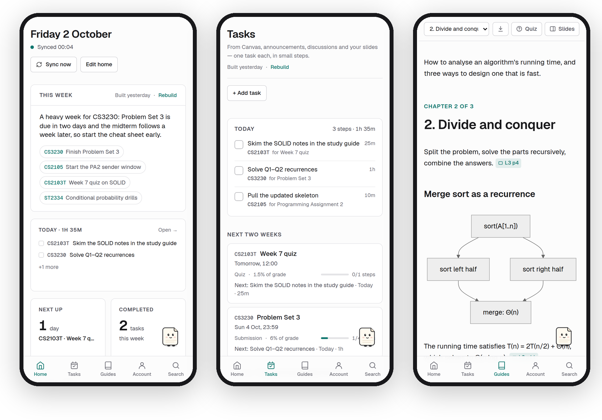
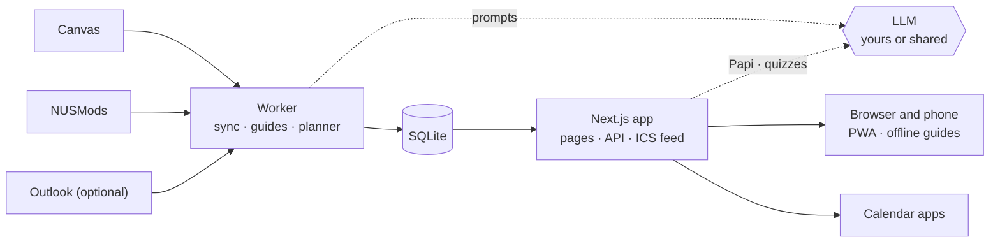

<div align="center">


# OpenPapr

**Your Canvas semester, planned.**

OpenPapr reads everything your university's Canvas posts and turns it into three things: study guides
that write themselves from your lecture slides, a to-do list broken into small daily steps, and a
paper sidekick who knows when everything is due.

[](https://github.com/mjykxz17/OpenPapr/actions/workflows/ci.yml)
[](LICENSE)


[](#contributing)

[Features](#features) · [Try it locally](#try-it-in-two-minutes) · [Self-host](#self-hosting) · [How it works](#how-it-works) · [Roadmap](#roadmap)

<br />

<picture>
  <source media="(prefers-color-scheme: dark)" srcset="docs/assets/home-dark.png" />
  
</picture>

</div>

> [!NOTE]
> OpenPapr began as one NUS student's answer to a familiar problem: forty Canvas notifications a
> week, five lecture decks with near-identical names, and a quiz announced in a forum reply you
> never opened. It now runs for a small group of students. It works with any Canvas instance,
> though some defaults (NUSMods exam dates, Singapore time) assume NUS.

## Why OpenPapr

Canvas is where your course *lives*, but it is not where you *study*. Deadlines are split across
assignments, quizzes, announcements, forum threads and lines buried on slide 47. Lecturers re-upload
a deck as `L5 v2 (updated).pdf` and the old one stays. Nothing tells you what to do *today*.

OpenPapr sits on top of Canvas and does the reading for you. It is self-hostable, open source, and
yours: every student brings their own Canvas token and, if they like, their own AI key.

## Features

### 📖 Study guides that write themselves

<picture>
  <source media="(prefers-color-scheme: dark)" srcset="docs/assets/guide-dark.png" />
  
</picture>

As each lecture deck lands on Canvas, OpenPapr groups it with earlier versions of the same deck,
works out which topics it covers, and writes (or rewrites) only those chapters. Every claim carries
a **slide chip** that opens the exact slide beside the text. Figures are the lecturer's own slides,
diagrams the slides only describe in words are redrawn with Mermaid, and the model names each guide
by what it teaches rather than by its file name. Topics tied to a graded quiz or assignment are
written first.

### ✅ Tasks, broken into steps you can do today

<picture>
  <source media="(prefers-color-scheme: dark)" srcset="docs/assets/tasks-dark.png" />
  
</picture>

One task per obligation, wherever it was posted: a Canvas quiz, a line in an announcement, a
lecturer's reply in a discussion, a "submit before Week 6" on a slide. Each becomes 15–90 minute
steps scheduled back from the due date, and steps you miss roll forward instead of piling up.
It also spots patterns: after Quiz 3, it expects Quiz 4.

- **Teach the planner.** Mark something *Not a real task* or correct a *Wrong date*. Both are
  remembered and shown to the planner next time, and a date you set is never moved again.
- **Quick add.** Use *+ Add task*, or tell Papi *"remind me to print the tutorial sheet by Friday"*.
- **Per-group forms collapsed.** Eight copies of "Tutorial 3 (Group A…H)" become one task: yours.

### 🔎 Search everything, from anywhere

<picture>
  <source media="(prefers-color-scheme: dark)" srcset="docs/assets/search-dark.png" />
  
</picture>

Press <kbd>⌘</kbd> <kbd>K</kbd> or <kbd>/</kbd> on any page. One box covers guide sections,
announcements, lecturers' forum replies, Canvas work, your tasks, files and modules. A guide result
opens the right chapter scrolled to the right heading.

### 🧠 Quiz yourself on any chapter

<picture>
  <source media="(prefers-color-scheme: dark)" srcset="docs/assets/quiz-dark.png" />
  
</picture>

Each chapter ends with practice questions written from that chapter only. Every question comes
with the reason behind the answer and the slide it is from. A set is kept until the chapter
changes, so asking again costs nothing.

### 📱 Made for your phone, readable on the train

<picture>
  <source media="(prefers-color-scheme: dark)" srcset="docs/assets/phone-dark.png" />
  
</picture>

Install it to your home screen like an app. **Save offline** keeps a guide and every slide it
shows, so it opens with no signal.

### And the rest

<table>
<tr>
<td width="50%" valign="top">

**🗓 Calendar sync.** A private feed for Google Calendar, Apple Calendar or Outlook, with
deadlines, quiz windows, expected quizzes and, if you want them, daily study steps.

</td>
<td width="50%" valign="top">

**🧩 A home screen made of widgets.** Drag, resize (S / W / L / Full) and hide widgets, just like
the home screen on a phone.

</td>
</tr>
<tr>
<td valign="top">

**📊 Assessment weighting.** Read from Canvas, or pulled out of the syllabus and the admin slides
with the quoted sentence as evidence. You can always override it.

</td>
<td valign="top">

**🗒 A weekly plan.** A short read on the week ahead and what to prioritise in each module, based
on your workload, your major and your past courses.

</td>
</tr>
<tr>
<td valign="top">

**💬 Ask your material.** Papi answers questions from your own slides, guides, notes and
announcements. Every claim carries a numbered source that opens the exact slide.
</td>
<td valign="top">

**🔐 Your data, your call.** Tokens and keys are encrypted at rest. Download everything as JSON,
or delete your account and every row with it.

</td>
</tr>
<tr>
<td valign="top">

**🤖 Bring your own model.** Works with any OpenAI-compatible endpoint (OpenAI, OpenRouter, Groq,
Ollama, vLLM…) or Anthropic, with an optional fallback provider. A shared key can be offered with
a monthly allowance per student.

</td>
<td valign="top">

**🌗 Light, dark and six accents.** Text meets WCAG AA contrast, and buttons are at least 44px for fingers.

</td>
</tr>
</table>

## Try it in two minutes

You don't need a Canvas account. A fictional semester (four modules, tasks, a weekly plan and a
study guide) ships with the repo.

```bash
git clone https://github.com/mjykxz17/OpenPapr.git && cd OpenPapr
npm install
npm run demo:seed                     # writes data/showcase.db

DATABASE_PATH=data/showcase.db \
SECRET_KEY=$(openssl rand -hex 32) \
APP_PASSWORD=change-me-please \
npm run dev
```

Open <http://localhost:3000> and sign in as **`demo`** / **`openpapr-demo`**.

> [!TIP]
> Without an AI key the app still runs. Canvas sync, tasks from Canvas, search, the calendar feed
> and Papi's date answers all work without one. Add a key on the **Account** page (or in `.env`) to
> switch on guides, the planner, quizzes and the weekly plan.

## Self-hosting

### Requirements

- **Node.js 22** (≥ 20 should work)
- A **Canvas** instance that allows personal access tokens
- *Optional:* an **LLM API key**, from any OpenAI-compatible provider or Anthropic
- *Optional:* **LibreOffice**, if your courses post `.pptx` decks; they are converted to PDF so slide
  citations work. The Docker image includes it.

### Run it yourself

```bash
cp .env.example .env          # fill in SECRET_KEY and APP_PASSWORD at minimum
npm install
npm run build && npm start    # web on :3000
npm run worker                # in a second terminal: Canvas sync, guides, planner
```

Migrations run automatically on startup. To sign up, a student opens the site and enters the
**invite code** (`APP_PASSWORD`) and their own **Canvas access token**. After that they can set a
username and password.

### Docker

```bash
docker build -t openpapr .
docker run -d -p 3000:3000 -v openpapr:/data \
  -e DATABASE_PATH=/data/openpapr.db \
  -e SECRET_KEY=$(openssl rand -hex 32) \
  -e SESSION_KEY=$(openssl rand -hex 32) \
  -e APP_PASSWORD=your-invite-code \
  -e CANVAS_BASE_URL=https://canvas.your-uni.edu \
  openpapr
```

One container runs both the web server and the worker, and restarts the worker if it ever dies.

### Fly.io

`fly.toml` is ready to use: one machine, one volume, a health check.

```bash
fly launch --copy-config --no-deploy
fly volumes create openpapr_data --size 1
fly secrets set SECRET_KEY=$(openssl rand -hex 32) SESSION_KEY=$(openssl rand -hex 32) APP_PASSWORD=your-invite-code
fly deploy
```

<details>
<summary><b>All environment variables</b></summary>

<br />

| Variable | Required | Default | Purpose |
| --- | :---: | --- | --- |
| `SECRET_KEY` | ✅ | — | 64 hex chars (`openssl rand -hex 32`). Encrypts stored tokens and keys. **Never rotate it**, or every stored credential becomes unreadable. |
| `APP_PASSWORD` | ✅ | — | The invite code new students enter with their Canvas token. Minimum 8 characters. |
| `SESSION_KEY` | recommended | `SECRET_KEY` | Signs session cookies. Rotating it signs everyone out and leaves credentials intact. |
| `DATABASE_PATH` | | `data/openpapr.db` | The SQLite file. All data lives here. |
| `CANVAS_BASE_URL` | | `https://canvas.nus.edu.sg` | Your institution's Canvas. |
| `OPENAI_COMPAT_BASE_URL` | | — | Any OpenAI-compatible `/v1` endpoint, used as the shared model. |
| `OPENAI_COMPAT_API_KEY` | | — | Key for that endpoint. |
| `OPENAI_COMPAT_MODEL` | | — | Model id on that endpoint. |
| `OPENAI_COMPAT_RPM` | | unlimited | Requests per minute allowed on the shared key. Extra requests wait in a queue instead of failing. |
| `EMBED_MODEL` | | host default | Embedding model on the shared provider, used to search your material by meaning. Without one, Papi falls back to word search. |
| `SHARED_MONTHLY_CALLS` | | `300` | AI calls each student may make on the shared key per month. Their own key is never limited. |
| `ANTHROPIC_API_KEY` | | — | Alternative shared provider. |
| `ANTHROPIC_MODEL` | | `claude-haiku-4-5` | Model on the Anthropic path. |
| `DISQUS_API_KEY` | | — | Adds NUSMods student reviews to module profiles. |
| `MS_CLIENT_ID` | | — | Microsoft Entra app id for the optional Outlook mail view. The Mail tab is hidden without it. |
| `POLL_INTERVAL_MS` | | `300000` | How often the worker syncs. |

Students can also add their own key, and a fallback provider, on the **Account** page. Both are
encrypted and only ever sent to the endpoint they entered.

</details>

## How it works



- **Worker** (`src/worker`). Every few minutes it syncs each student's Canvas, then works through
  the AI jobs in order of urgency: weighting extraction, deadline extraction, task planning, guide
  planning and writing, and the weekly plan. Every job is fail-open: if the model is down, the
  rules-only path still produces tasks and dates.
- **Guides** (`src/worker/guides.ts`, `src/enrich/guide-plan.ts`). Decks are fingerprinted by their
  text, so `L5.pdf` and `L5 (updated).pdf` count as one deck. A plan maps decks to topics, and each
  topic is rebuilt only when its inputs change.
- **Planner** (`src/worker/tasks.ts`). It reads every signal for a module (Canvas work, announcements,
  staff replies, planner notes, obligation lines from slides, weighting, the exam date and the
  student's corrections) and merges the result into existing tasks without touching steps the
  student has started.
- **Web** (`src/app`). Server components render everything, dates are formatted once in Singapore
  time, and a service worker (`public/sw.js`) keeps guides and slides readable offline.

<details>
<summary><b>Project layout</b></summary>

```
src/app/          Pages and API routes (App Router)
src/components/   UI: home widgets, StudyGuide, SlidePanel, tasks, Papi, search
src/connectors/   Canvas, Microsoft Graph and NUSMods clients plus pure normalisers
src/enrich/       LLM jobs: planner, guide planning and writing, weighting, profiles
src/worker/       The background loop
src/server/       Server-only logic: sessions, tasks, search, calendar, quizzes, usage
src/db/           Drizzle schema and repositories
src/lib/          Pure utilities: env, crypto, ICS, slide citations, dates
drizzle/          SQL migrations, applied on startup
scripts/          Operator scripts: demo seeds, set-password, deck cache, Outlook connect
e2e/              Playwright smoke tests
```

</details>

## Privacy and security

- Each student signs in with **their own Canvas token**. OpenPapr only ever sees what that student
  can see.
- Canvas tokens, AI keys and Outlook refresh tokens are **encrypted at rest** (AES-256-GCM).
  Passwords are hashed with scrypt.
- Calendar feeds use an **unguessable per-student link** that can be reset or turned off.
- **Download my data** gives a full JSON export with every secret removed. **Delete my account**
  removes every row.
- When AI is on, slide text, announcements and syllabus content are sent to the model provider the
  student or host configured. That trade-off is intended, and the app tells students about it.

OpenPapr is an independent project, not affiliated with or endorsed by any university or by
Instructure. Check that your use of your own course material complies with your institution's
rules.

## Roadmap

- [x] Canvas sync: assignments, quizzes, announcements, discussions, planner notes, files
- [x] Multi-student accounts (invite code and Canvas token, then username and password)
- [x] Automatic study guides with deck version detection and slide citations
- [x] Smart tasks with daily steps, quiz-series anticipation and planner feedback
- [x] Search, calendar feed, practice quizzes, offline guides, PWA
- [ ] **Course libraries**: share a generated guide with classmates in the same Canvas course, so
      a cohort pays for generation once
- [ ] **Grade planner**: "what do I need on the final?" from the weighting and known scores
- [ ] **Beyond NUS**: make the NUSMods and timezone assumptions configurable per institution
- [ ] **Local models**: a first-class Ollama setup guide and smaller prompts tuned for 8B models

Have an idea? [Open an issue](https://github.com/mjykxz17/OpenPapr/issues).

## Contributing

Pull requests are welcome. The project moves quickly, so for anything large please open an issue
first.

```bash
npm test                                 # Vitest: 500+ unit tests next to the code they cover
npx playwright test                      # e2e: seeds a fixture, builds, drives a real browser
npx tsc --noEmit                         # strict types
```

- **Tests first.** `foo.ts` sits next to `foo.test.ts`. Connectors are split into an HTTP client
  and a pure normaliser, so the normaliser can be tested without a network.
- **Never commit real data.** Fixtures are hand-written and fictional (see
  [`scripts/seed-showcase.ts`](scripts/seed-showcase.ts)). Real Canvas payloads contain capability
  URLs, other people's names and lecturers' material.
- **Schema changes:** edit `src/db/schema.ts`, run `npx drizzle-kit generate`, and commit the
  migration.

## License

[GNU AGPL v3.0 or later](LICENSE). If you run a modified OpenPapr for other people, you must share
your changes with them. LibreOffice is called as an external program and is not distributed with
this project.

<div align="center">
<br />

<br />
<sub>Made by students who were tired of finding out about quizzes the night before.</sub>
</div>
